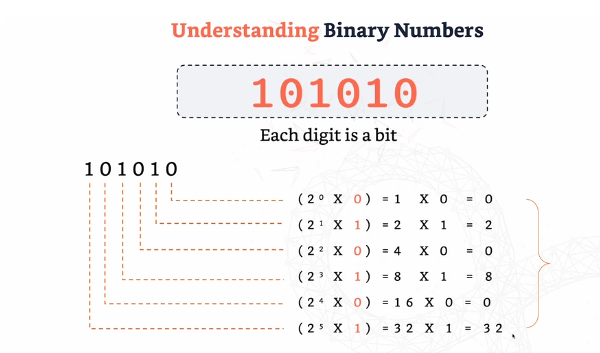
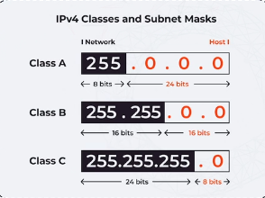

# Binary, Networking and Subnets

Binary is `key` for networking.

It's 1's and 0's. So a binary like `101010` is 6-bits. Binary is a `base-2` number system which means 2 is the base power. so the binary 101010 is broken down into:

We read from right to left, so the inital 0 is (2^0 * 0) = 0

Followed by 1 which is (2^1 * 1 ) = 1 etc

Once the entire binary is broken down, we `sum up` their totals and gives us the value of that binary.

### Converting IP address to Binary

An IP is formed of 4 sets of 8 octects, for example `192.168.1.1`. Each '.' is 8 octets for a total of 32 octets.

Breaking down that IP address into binary is as follows:
-192 into binary which is:  11000000.
- Divide 192 by 2 until you reach 0, noting down the remainders. = 92 remainder 0
- Then, 96/2 = 48, remainder 0
- 48/2 = 24, remainder 0, 24/2=12 remainder 0, 12/2=6 remainder 0, 6/2=3 remainder 0, 3/2=1 remainder 1, 1/2=0 remainder 1..
- Now we read these values in reverse from 1/2 all the way back to 192/2
- The result is:
    - 11000000

So the ip address `192.168.1.1` is converted into binary as:

192 (11000000), 168 (10101000), 1 (00000001), (00000001)

## Subnets

Subnets is simply dividing a large network into smaller, sub-networks (subnets).

It simply determines which part is the `network` and which is the `host`.

*/24 notation*

Example: 192.168.1.0/26

Calculate:
- Network Address
- Broadcast Address
- Useable IP addresses