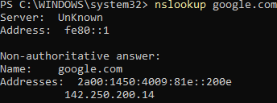

# DNS Tools

### Nslookup and Dig

Nslookup is a basic tool for querying DNS servers. Can find information about DNS records for that certain domain.

An example is `nslookup www.google.com` 

### Dig - Domain Information Groper 

More flexible and detailed than nslookup. Used by doing `dig www.google.com`

### Using nslookup

Entering `nslookup google.com` into powershell for example, returns the following data:

This command returned a `non-authoritative` answer. This means that the ip address for 'google.com' was already cached.