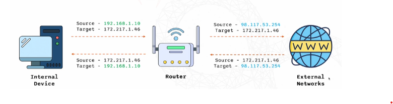

# NAT: Network Address Translation

Converts private IP's to a `single public ip address`.

It facilitates communication between internal network and in the internet. This is because if each private ip had to have a public ip address, there `wouldn't be enough ip addresses` as ipv4 is limited and theyre running out. (something ipv6 is solving)

### How NAT works

NAT Process:
- Internal devices use private IP addresses
- Router translates private IP to public IP
- Facilitates communication with external networks.

### Types of NAT

Static NAT: Maps a single private IP address to a single public IP address
- Use: A device that needs to be accessible from the internet with the `same` ip address everytime. 

Dynamic NAT: Maps a private IP address to one of many public IP addresses.

PAT: Port Address Translation
- Use: Multiple devices within a local network to be mapped to a single IP address but with `different port numbers`.

NAT Example:

> A User wants to connect to 'www.google.com'

> Router translates private IP to public IP

>  Google sees the `public` IP and not the users `private IP`

Benefits:
- Conservers public IP addresses
- Enchances network security (hide your internal ip)
- Simplifies network design and management