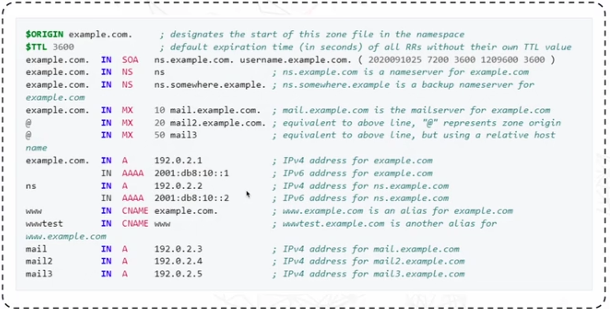
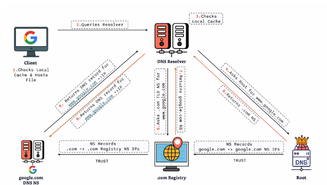

# DNS: Domain Name System

DNS translates domain names to IP addresses.

The role of DNS is to simplify navigation on the internet and its `essential` for accessing websites ands services.

## DNS Components

Name Servers (NS): Load DNS settings and configurations and also respond to queries from clients or servers to domain names and they can be authoritative or recursive

For example, I want to know what Name Servers google.com is hosted on, the query is returned as `ns1.google.come` through to `ns4.google.come`.

### Finding name servers for certain domains

Using `dig`, we can run the command `dig ns google.com` which returns comprehsensive detail about the name servers for google.com. We can use simpler command such as `dig +short ns google.com`.

## Zone files

These are stored inside the name servers and contain `info about the domain`. They help name servers answer queries about how to get to the domain if the name server does not the answer.

- Store information about the domain
- Organised and readable format

*example zone file*

## DNS Records

A zone file is made up of multiple records, where each record contains certain information about hosts, name servers amongs other things.

Their components are; `record name`, `TTL`, `Class`, `Type` and `Data`.

So the `Record Name` is the actual domain being queried.

TTL is `Time to Live` which indicates how long the record is valid before a refresh is required.

Class is the namespace of the record information.

The Type is the type of record, so can be `A` which is for ipv4 to `AAAA` for ipv6, MX or CNAME.

NS is the name server record.

Data, this is the actual information corresponding to the record type, similar to IP address for an A record.

### Record types

| Record | Description |
----------| --------------
| A | Maps a domain to an IPv4 address|
| AAAAA | Maps a domain to an IPv6 address |
| CNAME | Alias of one name to another. This allows you to point multiple domain names to the same IP address |
| MX | Specifies the mail server responsible for reciving emails for the domain |
| TXT | Allows domain administrators to insert any text into DNS. Commonly used for verification purposes and to hold SPF (Sender Policy Framework) data. |

# How DNS works

DNS resolution is simply the process of converting domain names into IP addresses.

DNS Root: "The Boss"
- Does store info about specific domains but contains `high-level information` about where to find the top level domains underneath it.

Top Level Domains (TLD)
- Contain familiar extenstions like .com, .org and .net
- Each TLD stores information about domains within is scope

Authoriative Name Servers
- Each authoritative NS hosts zones for domains, means they have the `detailed dns records` for those domains.
- Google.com and X.com have their own dns record stored here

Domain
- Each domain has its own `zone` and `zone-file` and we mentioned how zone files are detailed information about the domain.

### So what happens when you type google.com into a broswers?

Process:
- The browser sends a request to a `DNS resolver` that is local to you.
- The DNS resolver sends a request and looks for the IP address of google.com
    - Checks its local cache to see if it already knows google.com's ip address
- Queries the `Root Server` - which doesnt know the IP but `knows where to find the ip`.
- Resolver now queries the TLD (Top Level Domain) server which also doenst know the IP address but knows `which authoritative name server to ask`.
- Resolver queries the authoritative name server of google.com which has the ip address 
- IP address is resent to the DNS resolver
- DNS resolver sends it back to the user who made the request and can connect via `142.250.180.14`

### Importance of DNS resolution

- Ensures service `availability`
- Essential for troubleshooting DNS issues 
- Critical for configuring and managing network services (such as VPCs, subnets and security groups).

### Domain Registrar vs DNS Hosting Provider

Registrar:
- Allows the purchase and register the domain
- Communicates with a TLD registry to manage domain registration - Route 53, Cloudflare and GoDaddy.

DNS Hosting:
- Operates the DNS Nameservers
- Manage DNS records within hosted zones, Route53 Hosted Zones.

