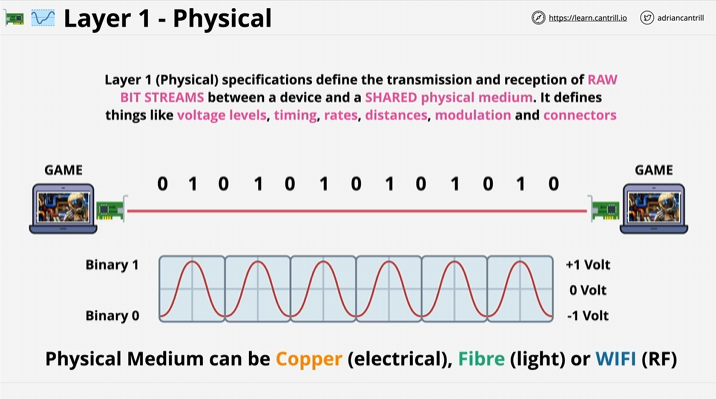

# Layer 1 - Physical Layer 

 Two devices with a Network Interface Card. Both are connected `Physically` using a `Phyiscal Medium` which can be either Copper (Electrical), Fibre (Light) or WIFI (RadioFrequency - RF).

 Layer 1 specifications define the transmission and reception of `RAW Bit Streams`between a device and a `Shared physical medium`. Things that are defined include Voltage levels, timing, rates, distances, modulation and connectors. Think of these like `Instructions`that define how to recieve raw bit streams (like an instruction manual).

 For `Copper cables` that use electrical, certain voltages are defined by `Binary 1` for 1 Volt and `Binary 0`for 0 Volts, this allows 0's and 1's to be transferred over the medium by 1 laptop and recieved by the other laptop or device.

### Physical hub

