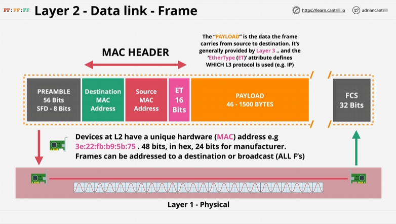
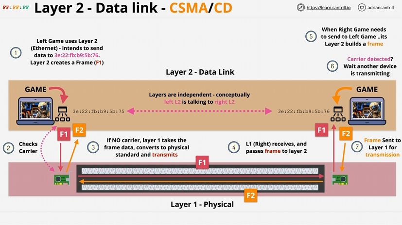

# Layer 2 DataLink Layer

1 - Everything above the data link layer, this is all device-device  
2 - Relies on layer 1 and requires a functional one running (physical layer)  
3 - Introduces Frames - a format that sends information over layer 2 network. It also introduces a MAC address 48bits in hex. The Mac address is attached to a physical peice of hardware  
4 - A Frame is like a container, has 'PREAMBLE' which is the start frame and allows devices to know what is the start of the frame. 8 Bits  
5 - A Destination and Source MAC Address is the second/third FRAME  
6 - ETHER Type (ET) Used to specifiy which layer 3 protocol is putting its data inside the frame. 16 Bits  
7 - Destination MAC, Source MAC and ET are all known together as MAC HEADER.  
8 - PAYLOAD: Contains the data the frame is sending, provided by the layer 3 Layer which is provided to the ET. Ranges from 46 - 1500 Bytes  
9 - Frame Check Sequence (FCS), used to identify any errors in the frame and is a simple CRC check.  

# Issues solved by Layer 2

Layer 1 is purely a physical connection between network interfaces - this means data is sent across the physical layer. If both devices send data this causes a `collision` corrupting both data

# Data Transfer between Layer 1 and 2 

Data is `encapsulated` between different layers. For example a Game between 2 physical devices on Layer 2, the `game data` is encapsulated in a `frame` which contains the state of this game at a particular second which is then sent down to layer 1 and transferred to the second device on the network.

# Key points to remember!

Whatever layer of the OSI model you are communicating with, that is the only thing that layer see's. For example, A device on Layer 2 only knows and sees its communication with another device on Layer 2. Even though Layer 2 is using Layer 1 to perform the physical communication.  

This is *common across the OSI Model* and is important! Anything below the point you're communicating with, is abstracted away! 

# Collisions within Layer 1

For example, 2 machines check for a carrier that does NOT exist causing both machines to instruct layer 1 to transmit at the same time - this causes the *collision*!  

Layer 2 Contains *Collision Detection* which is what the CD part in CSDMA/CD is for - A Jam signal is sent by all devices that detect it. A Random Backoff occurs. This is a period of time when no devices attemps a transmission.

# Using a HUB

Hubs are Layer 1 devices that dont understand `frames`. They just see physical data. They repeat physical activity on 1 port to ALL ports.  

*`HUBS aren't smart!`* -  This means if multiple machines transmit at the same time, this causes a collision which echos to all ports on the HUB.  

SWITCH! - This is a layer 2 device which works the same physically as a HUB but understands layer 2. Since this is now Layer 2, all devices connected to the Hub or in this case the Switch, have their own MAC address.  

The SWITCH understands frames and MAC addresses. They maintain a `MAC address table` which starts off empty. As they recieve frames on the ports, it learns which devices are connected and populates the MAC address table with the MAC and PORT.  

Switches `Store` and `Forward` unlike HUBS. This means only `valid` frames are forwarded - collisions are isolated on the port they occurred. Every X port swtich has X collision domainds. It allows switches to scale and be connected together.

# Important to note

Layer 2 is THE foundation for all networks which we use day-to-day. It's how wired networks work, WI-FI and the Internet as a whole! A Huge collection of `Interconnected layer 2 networks`.  

# Summary

- Identifiable devices  
- Media access control (device share access to media)  
- Collision Detection  
- Unicast: 1:1 communication  
- Broadcast: 1:ALL communication  
- Switches - Like a super powered HUB (Layer 2)