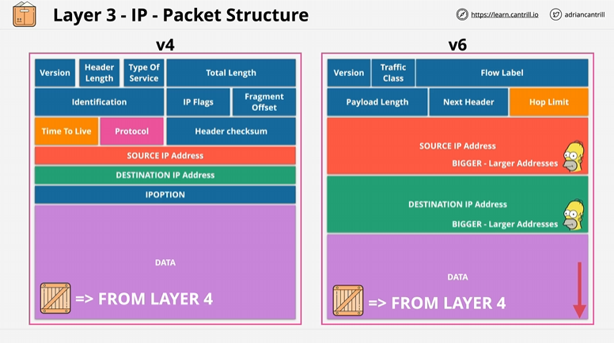

# Layer 3 Network Layer

## What is the Network layer?
The network layer requires 1 or more operational layer 2 - this is because each layer up builds on previous layers.  

The job of layer 3 is to `get data from one location to another`.  

Way's to visiualise this is, one Local Area Network (LAN) which contains 2-4 seperate devices connected via Layer 2 in US EAST and another LAN network with 2-4 devices connected in US WEST.  
These Devices are seperated geographically and are isolated from eachother. Only those networks joined by a direct point to point link using the `same` layer 2 protocol could communicate. (this is expensive and a giant mess)  

### Important note:

Not everything uses the same Layer 2 Network - some might use Ethernet (The most common method), there are others like `Wi-Fi`, `ATM`, `PPP - Point-to-Point Protocol` or `HDLC - High-level Data Link Control` for example.  

# Layer 3 Continued

To move data between different local networks, this is called `Inter-networking` which is where the name `Internet` comes from where we need Layer 3.  

Layer 3 can span multiple different Layer 2 networks and can be added to 1 or more Layer 2 networks. This adds the `Internet Protocol (IP)` which grants IP addresses - These are cross-network addresses, can be assigned to devices and are used to communicate across networks using routing.  

`Routers` are layer 3 devices, their function is to move `packets` of data across different intermediate networks. They encapsulate a packet inside an frames along the way. For example, Game on layer 2, Frame is `encapsulated` and transferred over the network until it reaches another network where that frame is removed, a new one is added around the same packet and moved onto the next local network.  

 # More on IP - Layer 3 Protocol

 The structure of `packets` which are the data unit used within the IP.  

 Packets are similar to frames from layer 2, contain some data to be moved and contain a `source` and `destination` address. The *difference* is that unlike in layer 2 where the source and destination are local, IP source and destination addresses can be `Global`.   

 Packets remain the same during their journey. 

 # Main Internet Protocols in use

 ### Version 4: Used for decades 
 ### Version 6: Adds more scalability to v4

V4:  
Protocol: Layer 3 so has data provided by another layer (layer 4) and this field stores which protocol is used. Example: `ICMP`, `TCP` and `UDP`  
Time To Live: Since packets move between multiple different intermediate networks, this defines how many hops a packet can go through (prevents packets moving around indefinetely)  
Source IP  
Destination IP  
DATA: Generally provided from Layer 4 Protocol.  

V6:  
Hop Limit: Controls similar to v4, max number of Hops before being discarded  
Source IP: Bigger, larger addresses (space taken in a packet to store ipv6 source and destination address is larget)  
Destination IP: Bigger, larger addresses 
Data: From Layer 4 as well

