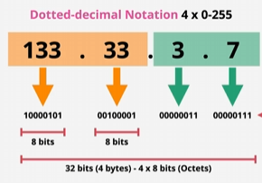
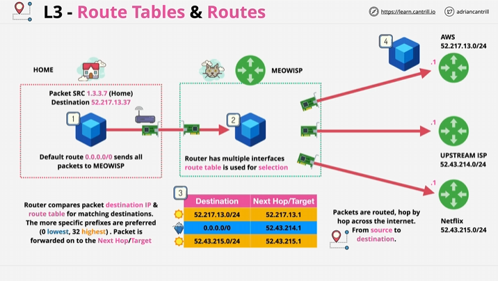

# Layer 3 Network Layer

## What is the Network layer?
The network layer requires 1 or more operational layer 2 - this is because each layer up builds on previous layers.  

The job of layer 3 is to `get data from one location to another`.  

Way's to visiualise this is, one Local Area Network (LAN) which contains 2-4 seperate devices connected via Layer 2 in US EAST and another LAN network with 2-4 devices connected in US WEST.  
These Devices are seperated geographically and are isolated from eachother. Only those networks joined by a direct point to point link using the `same` layer 2 protocol could communicate. (this is expensive and a giant mess)  

### Important note:

Not everything uses the same Layer 2 Network - some might use Ethernet (The most common method), there are others like `Wi-Fi`, `ATM`, `PPP - Point-to-Point Protocol` or `HDLC - High-level Data Link Control` for example.  

# Layer 3 Continued

To move data between different local networks, this is called `Inter-networking` which is where the name `Internet` comes from where we need Layer 3.  

Layer 3 can span multiple different Layer 2 networks and can be added to 1 or more Layer 2 networks. This adds the `Internet Protocol (IP)` which grants IP addresses - These are cross-network addresses, can be assigned to devices and are used to communicate across networks using routing.  

`Routers` are layer 3 devices, their function is to move `packets` of data across different intermediate networks. They encapsulate a packet inside an frames along the way. For example, Game on layer 2, Frame is `encapsulated` and transferred over the network until it reaches another network where that frame is removed, a new one is added around the same packet and moved onto the next local network.  

 # More on IP - Layer 3 Protocol

 The structure of `packets` which are the data unit used within the IP.  

 Packets are similar to frames from layer 2, contain some data to be moved and contain a `source` and `destination` address. The *difference* is that unlike in layer 2 where the source and destination are local, IP source and destination addresses can be `Global`.   

 Packets remain the same during their journey. 

 # Main Internet Protocols in use

 ### Version 4: Used for decades 
 ### Version 6: Adds more scalability to v4

V4:  
Protocol: Layer 3 so has data provided by another layer (layer 4) and this field stores which protocol is used. Example: `ICMP`, `TCP` and `UDP`  
Time To Live: Since packets move between multiple different intermediate networks, this defines how many hops a packet can go through (prevents packets moving around indefinetely)  
Source IP  
Destination IP  
DATA: Generally provided from Layer 4 Protocol.  

V6:  
Hop Limit: Controls similar to v4, max number of Hops before being discarded  
Source IP: Bigger, larger addresses (space taken in a packet to store ipv6 source and destination address is larget)  
Destination IP: Bigger, larger addresses 
Data: From Layer 4 as well

# IP Addressing

An ip address looks like `133.33.3.7` - This is known as dotted decimal notation.  
All IP addresses are formed of `2 parts`. The "network" part which is the 133.33 part which states which IP network this IP address belongs to and the host part which is .3.7 .

### Identifiying between 2 or more IP networks - Important to remember

If the network part of the two IP addresses match, theyre on the same IP network, otherwise they're not!  

IP addresses are only VISUALLY dotted decimals, i.e. : 133.33.3.7 is how we read it but they're actually `BINARY`! Each decimal part is an 8-bit binary number.  

Since IP addresses are binary and there are 4 sets, each set contains 8 bits totalling to 32-bits total.  

For the IP add 133.33.3.7: The 133 is represented in binary as `10000101`. since there are 4, they are 4x8 Bits or `Octets` and are always read LEFT TO RIGHT so 133 is the first octect. 

This network has a `/16 prefix`. This means 16 bits of the IP are the network, and the remaining bits are for the hosts.  

An IP address like `133.33.33.37` is the same NETWORK as the `133.33.3.7` but have `different Hosts`.  

IP Addresses get assigned by machines such as DHCP (Dynamic Host Configuration Protocol) or Humans. IP addresses need to be unique or many issues can arise.  

### Subnet Mask

Critical part of IP networking and configured on layer 3 interfaces. Also `Default Gateways` are configured, which is an IP address on the local network which packets are forwarded to, if the intended destination is not a local IP address.  

Subnet masks are what allow an IP device to know if an IP address its communicating to is on the same network or not and influences if it needs to use a gateway or can communicate locally. (This reminds me of the AWS VPC model - Internet Gateways).  

### Example

133.33.3.3 IP Address in binary is:  10000101.00100001.00000011.00000011.  

A Subnet Mask is configured on a host device in addition to an IP address eg. 255.255.0.0 and this is the same as a /16 prefix.  

A Subnet mask represents which part of the IP is for the network. You convert the subnet mask into a binary, so `255.255.0.0` is `11111111.11111111.00000000.00000000` so the /16 prefix is the number of 1's in the subnet mask starting from left, so 16 1's which is the same as 255.255.0.0 in `BINARY`  

When the subnet mask is in BINARY, anything with a 1 represents the *Network* and everything with a 0 represents the *Host*

## Identifying Start and Ends of Network IP Addressess.

So we Have the IP addresses `133.33.3.7` and `255.255.0.0`, in Binary:

133.33.3.7: 10000101.00100001.00000011.00000011
255.255.0.0: 11111111.11111111.00000000.00000000

So the start of the network: We look at the `network` part which is 133.33 because thats where it has 1's in the network Subnet Mask. The host part is all 0's so the START is: `133.33.0.0`.  

The end of the network: we take the `Host` part where the subnet mask is 0's and have all 1's in the IP address making it `133.33.255.255` as the ENDING.  

So TL;DR : The starting address of the local network is ALL 0's in teh HOST part and the ending is ALL 1's in the Host part of the IP.

## Route Tables and Routes

### Packet Journey from Home to Destination:

Source (SRC): The packet originates from IP 133.3.7 (Home).
Destination: The packet is headed to 52.217.13.37.
How does it get there?
Initially, the default route 0.0.0.0/0 is configured at Home, which means all traffic that isn’t specifically routed gets sent to the MEOWISP router (this is the first hop in the network).

Router's Role (MEOWISP):

The router has multiple interfaces (connections to different networks).
It uses a route table to decide which next hop to send the packet to, based on the destination IP address.  

Route Table: The router compares the destination IP address of the packet against its route table, which contains a list of possible destination networks and corresponding next hops. It chooses the most specific match to determine where the packet goes next.  

Route Table Entries (for comparison):

Destination: 52.217.13.0/24 → Next Hop: 52.217.13.1
Destination: 0.0.0.0/0 (default route) → Next Hop: 52.43.214.1
Destination: 52.43.215.0/24 → Next Hop: 52.43.215.1
The destination IP in the packet (52.217.13.37) matches the 52.217.13.0/24 entry in the route table. Therefore, the router forwards the packet to the next hop (52.217.13.1).

Next Hops Explained:

Each next hop represents another `device or router` in the network that will handle the packet until it eventually reaches its final destination.

In this case, the next hops lead to different networks:
AWS (52.217.13.0/24)
Upstream ISP (52.43.214.0/24)
Netflix (52.43.215.0/24)

### Key Notes:

Default Route (0.0.0.0/0): Sends all packets to a specific router if no better match is found in the routing table.

Routing Decision: The router `compares` the destination IP address with the routes in its route table. The most specific match is selected (longest prefix, e.g., /24 > /16 > /8).

Next Hop: Once the route is selected, the packet is sent to the specified next hop (target router or network).

 

 # Address Resolution Protocol (ARP)

 This is used when you have a layer 3 packet that you want to encapsulate it inside a frame and send the frame to a mac address. You initially *didnt know the mac address* and you need a protocol that can find it for a given IP address.  

### ARP simpliy provides the Mac address for a given IP address ##

The ARP Sends a L2 Broadcast to all Frames asking who has the specific IP Address of the destination IP Address.  

The Other device also has the ARP which responds to the broadcast stating that it is the owner of this broadcasted IP Address and and returns the MAC address. 

This Allowws the Sender ARP to populate the frame with the Destination MAC Address. This is then sent down to Layer 1 and transferred across the Physical Network.