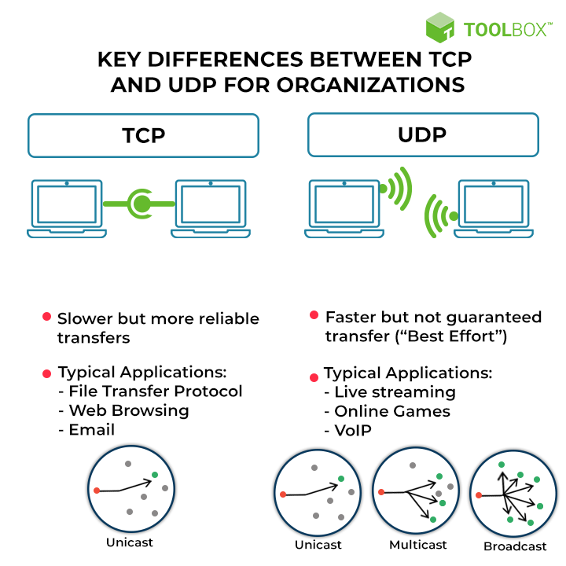

# Layer 4 - Transport Layer

The transport layer runs `ontop of the Network layer` and provides most of the functionality that supports most of the networking that is used day-to-day.

## Problems with Layer 3

A Source IP can generate multiple different packets destined for the `same destination IP`, however each packet is routed independently from the other.
A fair assumption is that the packets arrive at the same time, same order and same quality.. however this is NOT true.

This is the issue with communicating using only ip, causing intermittent network conditions, causing cases where arrival conditions are different to when they were generated.

One issue that can occur is `Out of Order Arrival` where packet 2 arrives AFTER 3. Routing decisions are `per packet`. Different routes can result in out of ordering packets at the destination and layer 3 provides NO ordering mechanism.

Packets can also go `Missing` due to network outages or conditions which cause temporary routing loops. So Layer 3 communication is `not guaranteed`.

Per packet routing can also have `delays`. Different packets can experience different delays which can be a serious issue for `time sensitive applications`.

### Key point to remember about layer 3: 
`Each Packet is Unique, Different, Isolated. What happens to one packet doesn't mean it will happen to the other packets.`

With layer 3, there are `no communication channels` which means they have a Source and Destination IP but not a method of splitting by APP or Channel.

IP has `no flow control`. If a source transmits faster than the destination can recieve it, it can saturate the destination causing packet loss.

## Layer 4

Layer 4 adds 2 new protocols.

TCP - Transmission Control Protocol
UDP - User Datagram Protocol

Both run ontop of IP. There are common terms that you might hear like `TCP/IP`, this is TCP is running on top of IP, you choose this for `Reliablity, error correction and ordering of data` and is used for most important application layer protocols (Layer 7) like HTTP, HTTPS and SSH.

TCP is a `connection oriented protocol` - this means you need a connection between 2 devices setting up a bi-directional channel for communication.

UDP - Is faster because it doesnt have the TCP overhead for the reliable transfer of data, simply means its less reliable.

TCP is more `RELIABLE` but UDP has better `PERFORMANCE`.

## TCP Segments

A Segment is simply just another `Container` for data like packets and frames in previous layers and are specific to TCP.

Key Note - Segments are contained in IP packets!

TCP Segments `are encapsulated within IP Packets` and are carried from Source to Destination. However, Segments `do NOT have Source or Destination IPs` as they use the IP packets (handled by Layer 3).

### Segment Structure

Source Port and Destination Port - Gives the combined TCP/IP protocol the ability to have `multiple streams` of converstions between 2 devices.

For example, Opening the AWS Web Interface we are communicating from a port on our local machine to a port on the AWS server, which is `TCP Port 443 - HTTPS`

`Source + Destination IP` + `Source and Destination Port`these together identify a `single converstation`. This concept is what allows SSH and HTTPs to exist on a `Single EC2 Instance` for example. 

Sequence Number - Is incrememnted with each segment that is sent and is `unique`. Can be used for error correcting and for when IP Packets are recieved and the TCP segments are pulled out, they can be correctly ordered - solving an issue from Layer 3.

Acknowledgment - Is the way one side can indicate that its recieved uppto and including a certain sequence number. This is because every segment that is sent *NEEDS* to be `acknowledged` because TCP is a `reliable protocol`.

Flags and other fields (*) - 9 Bits and has various controls over the TCP connection. Are used to close the connection or syncrhonise the sequence numbers. 

TCP Window - Defines the number of `bytes` that you indicate you're willing to recieve between acknowledgments. Once reached, the sender will pause until you acknowledge that amount of data. This is how `Flow Control` is achieved. 

Larger windows are more efficient due to the `Header` of a TCP segment taking up more space, and the smaller the window between allowing data to be recieved, the `more headers are involved`.

Checksum - Used for error checking, can arrange for re-transmission of data as required.

Urgent Pointer - This is a `16 bit` field that indicates the `location` of the last byte of urgent data in a TCP Segment. Simply put the Urgent data is data that needs to be processed ASAP.

From Source and Destination Port to Options and Paddings (Which aren't currently mentioned but sit below Checksum and Urgent Point) - These all together make up the `TCP Header`.

## TCP 

Since TCP is `connection-based`, a connection is established between two devices that use a `random port` on a client and a `known port` on the server.
- This connections bi-directional. 

Since this is TCP, the connection is reliable which is due to the segments being encapsulated in the `IP Packets`. They come with all the flaws of IP packets like no error-checking or ordering.

Since IP Packets can be recieved out-of-order and because they dont specifiy ports, they `cant be used for`multiple applications or multiple clients (because the server can't seperate what relates to what). 

Communication between a server and a client still `use packets from layer 3` but we know that these are isolated from each other.
- Layer 4 takes data provided to it and splits in into `segments` which are then encapsulated into IP Packets. These segments contain a `sequence` number which maintains the order of the segments  

 So the benefit of these segments are just that they allow data communication to have in a consisten reliable fashion, and if issues arrive such as one packet being destroyed they can be `re-transmitted`.

A Client will communincate from its `source port`, which can be any port for example: port 23060 and it communicates with the `server port` on a `well known port` such as 443. 

The port opened up on the client (your machine) opens up a temporary port or `Ephemeral port` which is usually a higher port range like 23060. 

So a Client<->Server communication has a Source port and a Destination port. Since communication is bi-directional, the Source port can also be swapped into the Destination port.

Layer 4 sees these as different and this is why you need `2 sets of rules` on a network ACL within AWS for example, one for Client>Server and one for Server>Client.

#### Note:
When Epehemeral Port is mentioned or High port, this is what the `client picked as the source port`. 

# Summary of TCP vs UDP

| TCP:   | UDP  |
|------  | ------ |
|Connection-Oriented | Connectionless|           
| Reliable, ensures data delivery and order | Less reliable, no guarantee of deliver or order |
| Slower due to overhead of connection setup | Faster, no connection setup required
|Error-checking and flow control| No error-checking or flow control
|Web browsing,email, file transfer| Video streaming, online gaming, DNS, VPN