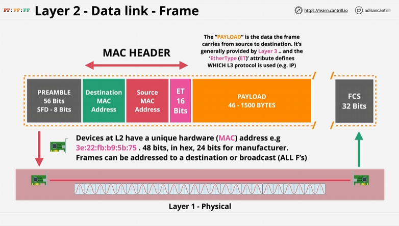

#  My Notes on the OSI Model #

# Layer 2 DataLink Layer

1 - Everything above the data link layer, this is all device-device  
2 - Relies on layer 1 and requires a functional one running (physical layer)  
3 - Introduces Frames - a format that sends information over layer 2 network. It also introduces a MAC address 48bits in hex. The Mac address is attached to a physical peice of hardware  
4 - A Frame is like a container, has 'PREAMBLE' which is the start frame and allows devices to know what is the start of the frame. 8 Bits  
5 - A Destination and Source MAC Address is the second/third FRAME  
6 - ETHER Type (ET) Used to specifiy which layer 3 protocol is putting its data inside the frame. 16 Bits  
7 - Destination MAC, Source MAC and ET are all known together as MAC HEADER.  
8 - PAYLOAD: Contains the data the frame is sending, provided by the layer 3 Layer which is provided to the ET. Ranges from 46 - 1500 Bytes  
9 - Frame Check Sequence (FCS), used to identify any errors in the frame and is a simple CRC check.  

# Issues solved by Layer 2

Layer 1 is purely a physical connection between network interfaces - this means data is sent across the physical layer. If both devices send data this causes a `collision` corrupting both data

